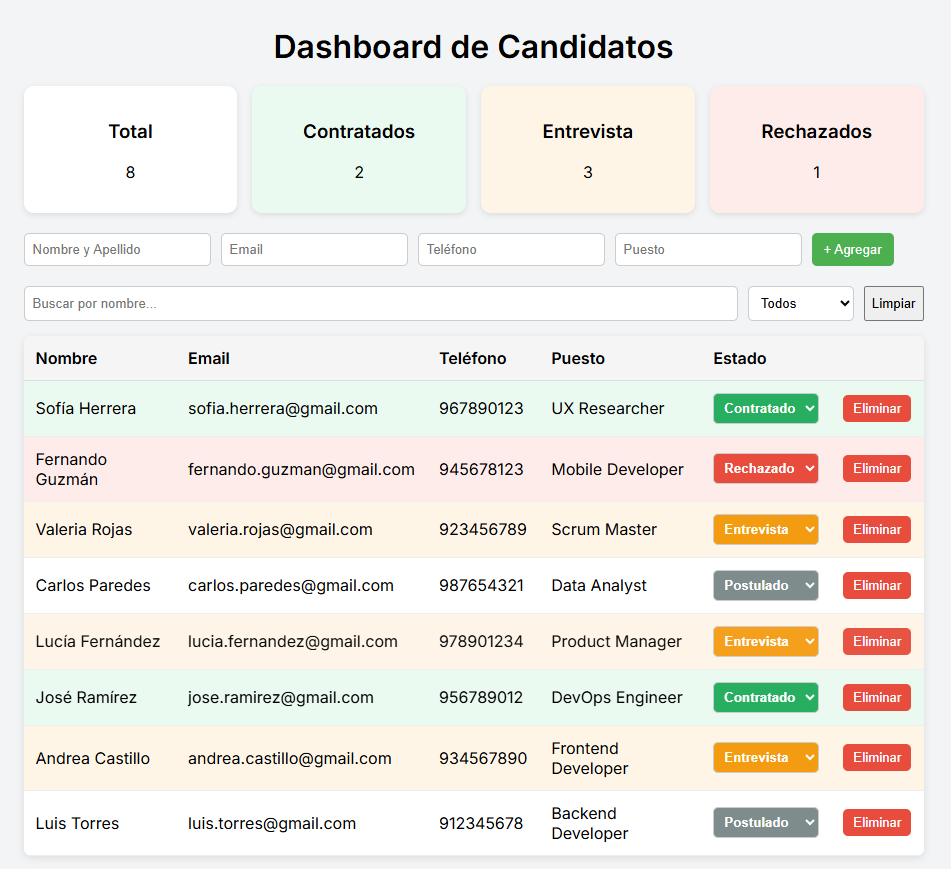

# Selection Latam Test

Evaluación técnica para el puesto de practicante Fullstack.

## Dashboard de Candidatos

Aplicación web simple para gestionar candidatos en un proceso de selección.

Funcionalidades:

- Agregar candidatos (nombre, email, teléfono, puesto)
- Listar candidatos
- Filtrar por nombre y estado
- Actualizar el estado (Postulado, Entrevista, Contratado, Rechazado)
- Eliminar candidatos
- Visualizar métricas (totales por estado)



---

## Cómo ejecutar el proyecto

### 1. Clonar el repositorio

```bash
git clone <URL_DEL_REPO>
cd <NOMBRE_DEL_PROYECTO>
```

---

### 2. Backend

```bash
cd backend
npm install
node index.js
```

El backend correrá en:

```
http://localhost:3000
```

---

### 3. Frontend

En otra terminal:

```bash
cd frontend
npm install
npm run dev
```

El frontend correrá en:

```
http://localhost:5173
```

---

## Notas

* No se usa base de datos, los datos se almacenan en un archivo JSON.

